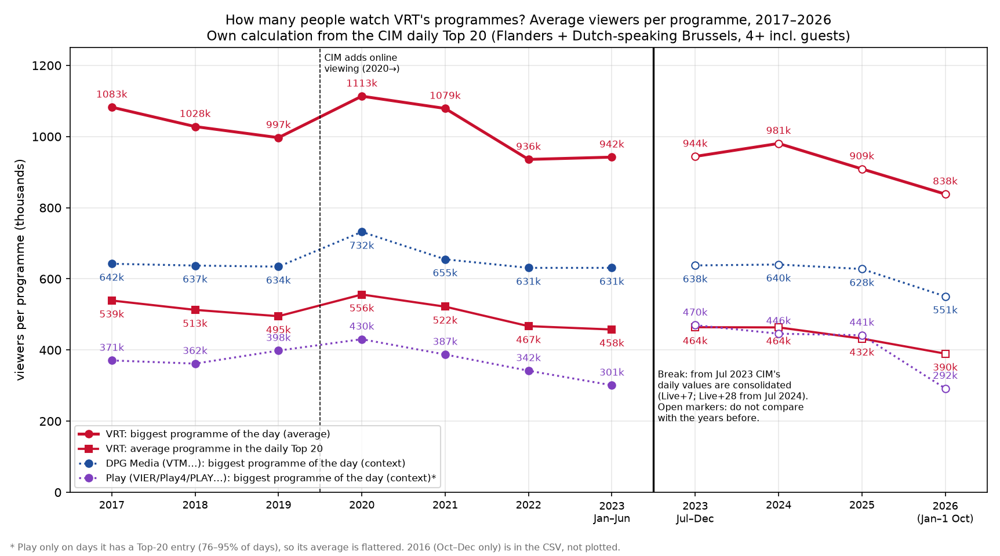
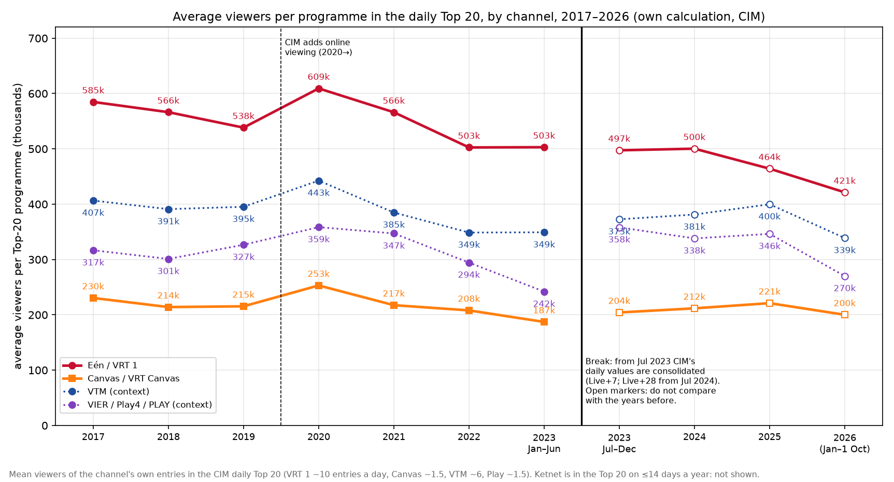
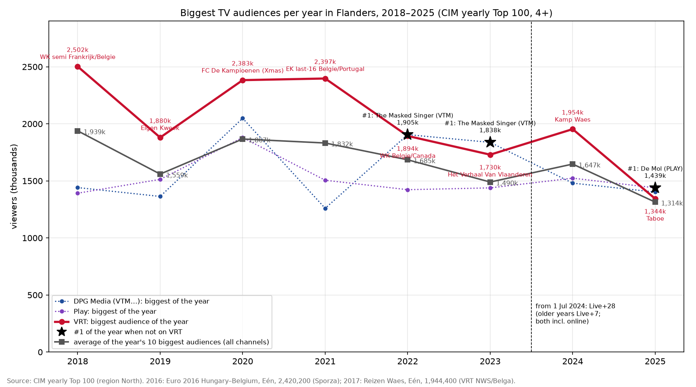
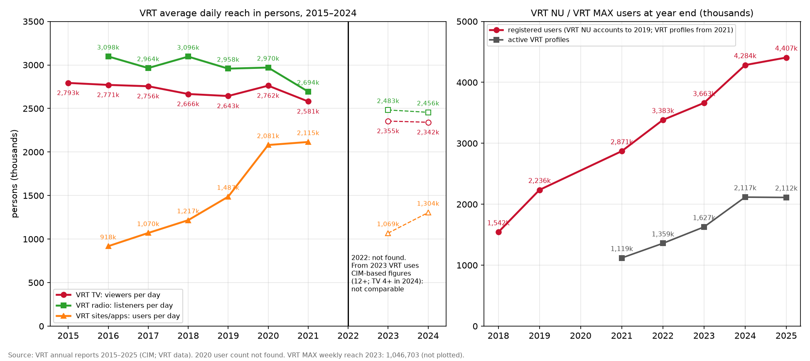
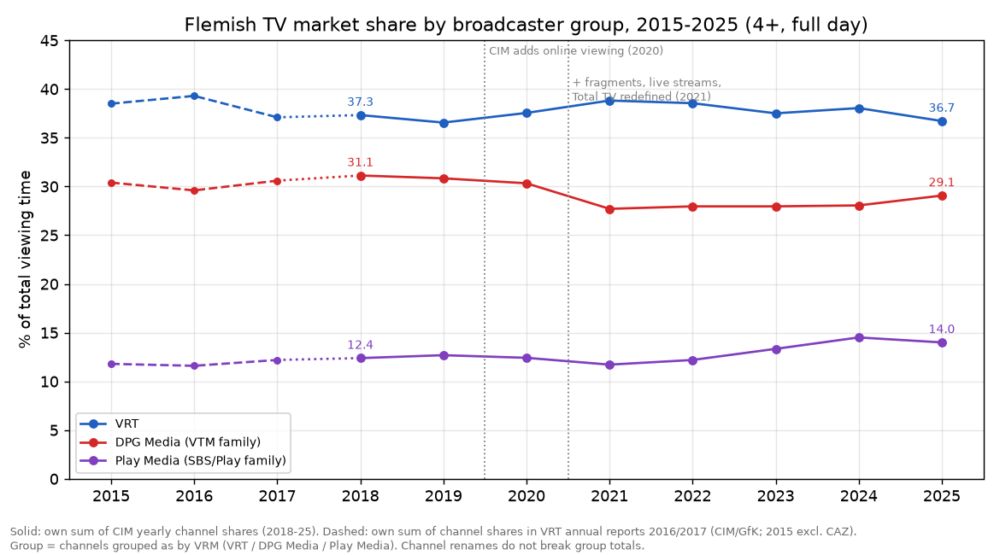
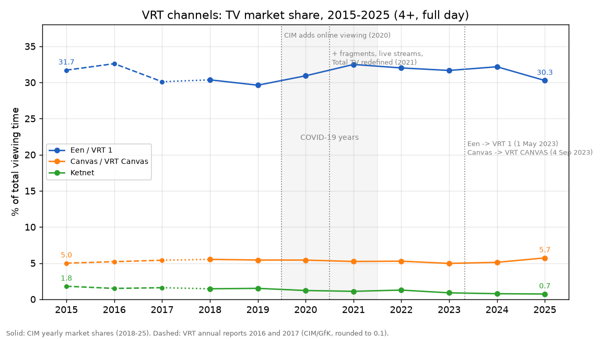
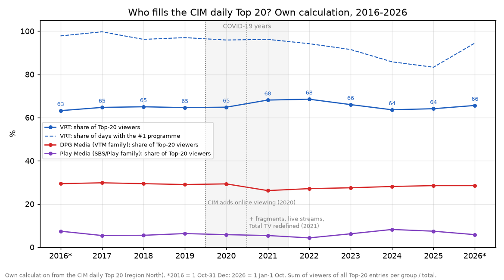
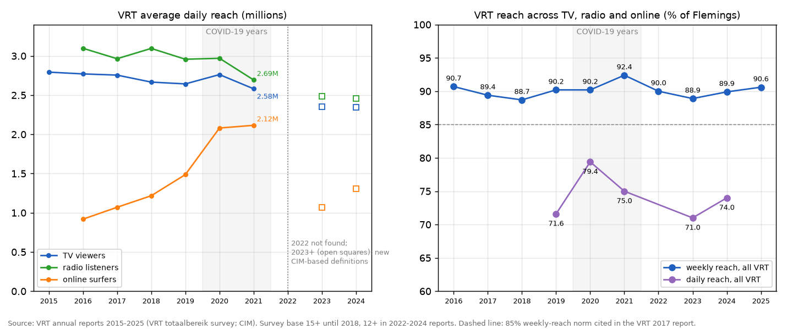
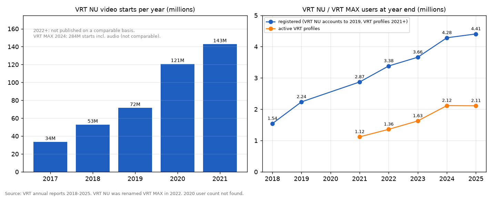

# VRT overall TV ratings: a 10-year report (2016–2026)

How did VRT, the Flemish public broadcaster, do on television over the last ten years? This report leads with **absolute numbers**: how many viewers VRT's programmes draw, how many people VRT reaches each day, and how many people use VRT NU / VRT MAX. Market share per channel and per broadcaster group follows as a secondary view. It sits next to the
[VRT NWS Journaal 10-year report](https://github.com/STP-KAS/vrt-nws-journaal-10yr-report), which looks at the 13:00 and 19:00 news only.

Every number in this repository is either copied from a named source (with its URL in a CSV) or is an **own calculation** from such numbers, and is labelled that way. When a figure could not be found, the table says "not found".

## Why

* VRT is paid for with public money. Its management agreement (*beheersovereenkomst*) sets reach targets, and its market share is a recurring topic in debates about the public broadcaster's role. The commercial groups DPG Media (VTM) and Play Media (Play, formerly VIER) compete for the same viewers.
* The figures exist, but they are spread across CIM web tables, VRT annual reports with definitions that change, and the media regulator's (VRM) concentration reports. This repository puts them side by side for about 2016–2026 and marks where definitions change.
* Questions answered: How many viewers do VRT's programmes draw, and is that going up or down? How many people does VRT reach? Is VRT's TV share going up or down? How do VRT 1 (formerly Eén), VRT Canvas and Ketnet each contribute? How does VRT compare with the DPG and Play channel groups? How many Flemings does VRT reach each day and week? How fast did VRT NU / VRT MAX grow? Which programmes were the most watched each year?

## How

1. **Market shares (CIM).** The CIM yearly market-share tables (region North, total population 4+, full day 02:00–26:00) for 2018–2025 were read from [cim.be/nl/televisie](https://www.cim.be/nl/televisie), with every channel CIM lists. The CIM page for 2017 returns no table. For 2015–2017 the channel shares printed in the VRT annual reports (source: CIM/GfK audimetry) are used instead.
2. **Group totals (own calculation).** Channels are grouped the way the regulator VRM does it ("VRT", "DPG Media-zenders", "Play Media-zenders"; [VRM 2025, p. 211](https://www.vlaamseregulatormedia.be/sites/default/files/2025-12/mediaconcentratierapport_2025.pdf)). Group shares are the sum of the CIM channel shares. Checks: the sums reproduce VRT's published TV share for 2018–2020 (37.3 / 36.6 / 37.6%) and VRM's 2024 totals (VRT 38.05%, DPG 28.06%, Play 14.51%) exactly. *Play Sports Open* (a Telenet sports channel) is left out of the Play group, which is how VRM's 14.51% comes out. Renamed channels stay in their group (Q2→VTM 2, VIER→Play4→PLAY, Eén→VRT 1 and so on), so group totals do not break at a rename.
3. **Reach and digital.** Figures were copied verbatim from the VRT annual reports 2015–2025 (infobox "Dagelijks/Wekelijks bereik" and the text on VRT NU / VRT MAX), from VRT press releases, and from the VRM report. Each figure is listed with its report, its location in the report and its population basis in [`data/sourced_figures.csv`](data/sourced_figures.csv).
4. **Top programmes.** These come from the CIM yearly Top 100 for 2018–2025. CIM publishes no yearly Top 100 page for 2016–2017, so news reports quoting CIM figures are used (marked secondary).
5. **Daily Top 20 (own calculation).** For every day from 1 Oct 2016 to 1 Oct 2026 (3,645 days with data), the CIM daily Top 20 (North) was used to count how many of the 20 places, and what share of the summed Top-20 viewers, each group held, and which group had the day's #1. Duplicate rows (CIM lists 1 Apr 2018 twice) and places 21–25 (some days in spring 2022) are removed. Simulcasts on several groups' channels (e.g. *Kastaars!*, *Oekraïne 12-12*) are counted separately.
7. **Absolute programme audiences (own calculation).** From the same daily Top 20, two plain measures per day, then averaged over the days of each year:
   * **"Biggest programme of the day"**: the viewer count of the group's most-watched programme that day (on any of its channels).
   * **"Average Top-20 programme"**: the mean viewer count of all of the group's entries in that day's Top 20 (VRT has about 11–12 of the 20 places, DPG 6–7, Play 1–2).
   These are audiences of single programmes, **not** the number of different people who watched VRT, and they only cover each day's 20 biggest programmes. Viewers are CIM's "4+ incl. guests". Play is not in the Top 20 every day (on 76–95% of days, depending on the year), so its figures average only the days it is present. Per channel (VRT 1, Canvas, Ketnet, VTM, the main Play channel) the same is done with that channel's own entries. Nothing is multiplied by a population figure.
8. **Value basis of the daily figures (own check).** The same broadcast was looked up in the daily Top 20 and in CIM's yearly Top 100. Up to late June 2023 the daily value is typically about 10% lower (monthly averages 0.75–0.99 of the yearly-list value: same-day viewing). From early July 2023 it is about equal (0.97–1.01), and from 1 Jul 2024 exactly equal (consolidated with 7, later 28, days of delayed and online viewing). CIM's TV page confirms each programme is reported three times (Live+VOSDAL, Live+7, Live+28). The absolute series are therefore **split at 1 Jul 2023**, and 2023 is shown as two half years. Like-for-like comparisons only use months on the same basis.
9. **Biggest audiences per year.** From the CIM yearly Top 100 (2018–2025): each group's biggest entry, with programme name, and the average of the year's 10 biggest entries on any channel.
10. **Methodology breaks** are listed with sources in [`data/methodology_breaks.csv`](data/methodology_breaks.csv) and marked on the charts.

## Sources

**Primary** (the organisation that measures or reports the figure):

| Source | Used for |
|---|---|
| CIM, TV results: [cim.be/nl/televisie](https://www.cim.be/nl/televisie) (yearly market shares, yearly Top 100, daily Top 20, key figures; region North) | channel and group shares 2018–2025, top programmes 2018–2025, all daily Top-20 calculations (shares and absolute audiences), the statement that each programme is reported Live+VOSDAL, Live+7 and Live+28 |
| CIM [TV regulations](https://www.cim.be/sites/default/files/2026-03/reglement_TELEVISIE.pdf) and [TV methodology 2024](https://cim.be/sites/default/files/2026-03/methodologie_television_Methodologie_NL2024.pdf) | methodology breaks (online viewing added 2020, fragments and live streams 2021, Total TV redefined 2021, 28-day window) |
| VRT annual reports: [2015](https://www.vrt.be/nl/assets/files/2024-09/jaarverslag2015.pdf), [2016](https://www.vrt.be/nl/assets/files/2024-09/VRTJaarverslag2016.pdf), [2017](https://www.vrt.be/nl/assets/files/2024-09/LRN-VRT-Jaarverslag-2017-web-low-2.pdf), [2018](https://www.vrt.be/nl/assets/files/2024-09/VRTJaarverslag2018WEB.pdf), [2019](https://www.vrt.be/nl/assets/files/2024-09/VRT_Jaarverslag-2019-CORPS-lowlowres.pdf), [2020](https://www.vrt.be/nl/assets/files/2024-09/VRT_jaarverslag2020_A4_030_pages_Compressed.pdf), [2021](https://www.vrt.be/nl/assets/files/2024-09/Jaarverslag2021.pdf), [2022 (jaarbeeld)](https://www.vrt.be/nl/assets/files/2024-09/VRTjaarbeeld2022.pdf), [2024](https://www.vrt.be/nl/assets/files/2025-06/Jaarverslag-2024.pdf), [2025](https://www.vrt.be/nl/assets/files/2026-07/JVS_2025_0.pdf) | VRT TV share 2015–2020, channel shares 2015–2017, daily and weekly reach, VRT NU / VRT MAX figures |
| VRM, [Mediaconcentratie in Vlaanderen 2025](https://www.vlaamseregulatormedia.be/sites/default/files/2025-12/mediaconcentratierapport_2025.pdf) (pp. 210–212) | 2024 group shares, C3 concentration 2015–2024, VRM group definitions |
| VRT press releases: [VRT MAX 2024](https://communicatie.vrt.be/2024-het-jaar-van-een-nieuwe-groeispurt-voor-vrt-max), [annual report 2025](https://communicatie.vrt.be/vrt-bereikt-recordaantal-vlamingen-en-versnelt-digitale-groei-in-2025) | VRT MAX use 2024, weekly reach and registered users 2025 |
| Rename announcements: [VRT NWS (Eén → VRT 1)](https://www.vrt.be/vrtnws/nl/2023/04/28/een-wordt-vanaf-vandaag-vrt-1/), [VRT (Canvas → VRT CANVAS)](https://www.vrt.be/nl/over-ons/nieuws-over-vrt/canvas-wordt-vrt-canvas), [DPG Media (Q2/Vitaya/CAZ → VTM 2/3/4)](https://communicatie.dpgmedia.be/van-familiezender-naar-een-familie-van-zenders-vtm-breidt-vanaf-het-najaar-uit-met-vtm-2-vtm-3-en-vtm-4), [Telenet (Play4 → PLAY etc.)](https://www2.telenet.be/residential/nl/klantenservice/tv-en-entertainment/zenders/zenderaanpassingen.html) | dates of the channel renames |

**Secondary** (a third party reporting or re-hosting primary figures):

| Source | Used for |
|---|---|
| [VRT annual report 2023, copy hosted by Mediaspecs](https://www.mediaspecs.be/wp-content/uploads/2024/06/vrt-jaarverslag-2023.pdf) | 2022–2023 reach, VRT MAX weekly reach, registered profiles (no copy found on vrt.be) |
| [VRT NWS / Belga, 12 Feb 2018](https://www.vrt.be/vrtnws/nl/2018/02/12/deze-programma-s-haalden-in-2017-de-hoogste-kijkcijfers/) | most-watched programme of 2017 (CIM figures) |
| [Sporza, 1 Aug 2016](https://sporza.be/nl/2016/08/01/ek-match-hongarije-belgie-levert-kijkcijferrecord-op-1-2727087/) | 2016 record (CIM-corrected Euro 2016 figures) |
| [Mediaspecs, 28 Jan 2021](https://www.mediaspecs.be/vier-vijf-en-zes-worden-play4-play5-en-play6-vanaf-2-april-nieuwe-vrouwenzender-play7/) | VIER/VIJF/ZES → Play4/5/6 rename date (reprints the press release) |

## Conclusion

### Absolute numbers (main)

**In short: VRT's biggest programmes draw fewer viewers than ten years ago, while its online audience grew.**

* **Biggest VRT programme of the day:** on an average day it had **1,083k viewers in 2017** and **936k in 2022** (−14%, same-day ratings). From July 2023 CIM's daily figures include delayed and online viewing, which lifts them. On that basis it was 981k in 2024, 909k in 2025 and **838k in 2026 (Jan–1 Oct)**. For the same months, 2026 is **7.3% below 2025**, and Jan–Jun 2023 was 6.7% below Jan–Jun 2022. (Own calculation, CIM daily Top 20.)
* **Average VRT programme in the daily Top 20:** **539k (2017) → 467k (2022)**, or −13%. On the consolidated basis: 464k (2024) → 432k (2025) → **390k (2026)**.
* **Per channel** (average Top-20 programme): **VRT 1 585k → 503k** (2017 → 2022) and 464k → 421k (2025 → 2026). **Canvas** stays at about **190–250k**. Ketnet is almost never in the Top 20. VTM, for comparison, went from 407k to 349k (2017 → 2022) and from 400k to 339k (2025 → 2026).
* **Competitors:** DPG's (VTM) biggest programme of the day held at **642k (2017) → 631k (2022)**, so VRT's lead at the top of the evening narrowed from about 440k to about 305k viewers. In 2026 it is 551k against VRT's 838k. Play's biggest programme (on days it is in the Top 20) is about 300–470k.
* **Peak audiences:** the average of the year's **10 biggest audiences on any channel** fell from **1.94 million (2018) to 1.31 million (2025)** (−32%), even though the 2025 figures include up to 28 days of delayed and online viewing. VRT's best audience of the year fell from **2,502,400** (2018, World Cup semi-final France–Belgium) to **1,343,500** (2025, *Taboe*). In 2025, for the first time in the data, a Play programme (*De Mol*, 1,439,000) was the year's #1.
* **2020 is a bump** in every series (VRT's biggest programme of the day averaged 1,113k). That was the year of the COVID-19 lockdowns and also the year CIM added online viewing (see the break line).
* **People reached:** VRT TV reached **2,793,435 Flemings a day in 2015** and **2,580,861 in 2021** (−7.6%). From 2023 VRT reports CIM-based figures on a different basis (2,355,396 in 2023, 12+; 2,341,668 in 2024, 4+), so these cannot be compared one-to-one with earlier years. VRT radio reached 3.10 million a day (2016) and 2.69 million (2021). VRT online reached 0.92 million a day (2016) and 2.12 million (2021).
* **VRT NU / VRT MAX:** registered users grew from **1,542,167 (2018) to 4,407,068 (2025)**. Active VRT profiles grew from **1,118,784 (2021) to 2,111,700 (2025)**.
* **Not found:** a public average audience (AMR) per channel or for prime time, and total viewing minutes per person after 2019 (see *Other*). No market share has been converted into viewers, because no source gives the base to do that.



| Period | VRT: biggest programme of the day | VRT: average Top-20 programme | VRT 1 / Eén: avg Top-20 programme | Canvas: avg Top-20 programme | DPG: biggest programme of the day | VTM: avg Top-20 programme | Play: biggest programme of the day* | All channels: #1 of the day |
|---|---|---|---|---|---|---|---|---|
| 2016 (Oct–Dec) | 1,172k | 595k | 636k | 223k | 719k | 459k | 665k | 1,175k |
| 2017 | 1,083k | 539k | 585k | 230k | 642k | 407k | 371k | 1,081k |
| 2018 | 1,028k | 513k | 566k | 214k | 637k | 391k | 362k | 1,033k |
| 2019 | 997k | 495k | 538k | 215k | 634k | 395k | 398k | 1,003k |
| 2020 | 1,113k | 556k | 609k | 253k | 732k | 443k | 430k | 1,121k |
| 2021 | 1,079k | 522k | 566k | 217k | 655k | 385k | 387k | 1,085k |
| 2022 | 936k | 467k | 503k | 208k | 631k | 349k | 342k | 950k |
| 2023 Jan–Jun | 942k | 458k | 503k | 187k | 631k | 349k | 301k | 971k |
| 2023 Jul–Dec ⚠ | 944k | 464k | 497k | 204k | 638k | 373k | 470k | 947k |
| 2024 ⚠ | 981k | 464k | 500k | 212k | 640k | 381k | 446k | 1,011k |
| 2025 ⚠ | 909k | 432k | 464k | 221k | 628k | 400k | 441k | 949k |
| 2026 Jan–1 Oct ⚠ | 838k | 390k | 421k | 200k | 551k | 339k | 292k | 845k |

*Own calculation from the CIM daily Top 20 (North, 4+ incl. guests), averaged over all days in the period ([`data/cim_daily_top20_absolute_by_group_owncalc.csv`](data/cim_daily_top20_absolute_by_group_owncalc.csv), [`data/cim_daily_top20_absolute_by_channel_owncalc.csv`](data/cim_daily_top20_absolute_by_channel_owncalc.csv)). ⚠ = from 1 Jul 2023 the daily figures are consolidated (Live+7; Live+28 incl. online from 1 Jul 2024) and run higher than the same-day figures before. Do not compare across that line without the same-period table below. 2016 covers Oct–Dec only (the autumn season, so it runs high) and is not charted. \* Play: only days with a Play programme in the Top 20.*

Like-for-like comparisons (same months, same basis):

| Comparison | Group | Biggest programme of the day | Average Top-20 programme | Basis |
|---|---|---|---|---|
| Jan-Jun 2022 vs Jan-Jun 2023 | VRT | 1,010k → 942k (-6.7%) | 509k → 458k (-10.1%) | both same-day |
| Jan-Jun 2022 vs Jan-Jun 2023 | DPG Media (VTM family) | 679k → 631k (-7.1%) | 375k → 344k (-8.4%) | both same-day |
| Jan-Jun 2022 vs Jan-Jun 2023 | Play Media (SBS/Play family) | 334k → 301k (-10.0%) | 287k → 239k (-16.5%) | both same-day |
| Jul-Dec 2022 vs Jul-Dec 2023 | VRT | 863k → 944k (+9.4%) | 425k → 464k (+9.3%) | STRADDLES THE BREAK |
| Jul-Dec 2022 vs Jul-Dec 2023 | DPG Media (VTM family) | 583k → 638k (+9.4%) | 311k → 367k (+18.0%) | STRADDLES THE BREAK |
| Jul-Dec 2022 vs Jul-Dec 2023 | Play Media (SBS/Play family) | 350k → 470k (+34.2%) | 281k → 336k (+19.4%) | STRADDLES THE BREAK |
| Jan-1 Oct 2025 vs Jan-1 Oct 2026 | VRT | 904k → 838k (-7.3%) | 428k → 390k (-9.0%) | both consolidated |
| Jan-1 Oct 2025 vs Jan-1 Oct 2026 | DPG Media (VTM family) | 598k → 551k (-7.9%) | 373k → 324k (-13.1%) | both consolidated |
| Jan-1 Oct 2025 vs Jan-1 Oct 2026 | Play Media (SBS/Play family) | 354k → 292k (-17.5%) | 281k → 249k (-11.4%) | both consolidated |

*Own calculation ([`data/cim_daily_top20_same_period_comparisons_owncalc.csv`](data/cim_daily_top20_same_period_comparisons_owncalc.csv)). The Jul–Dec rows show how large the jump from the change of basis is: about +9% for VRT, against an underlying trend of about −7% a year.*





| Year | VRT's biggest audience | #1 of the year (if not VRT) | DPG's biggest | Play's biggest | Average of the 10 biggest (all channels) |
|---|---|---|---|---|---|
| 2016 | EK last-16 Hungary–Belgium (Eén) 2,420,200 ¹ | same | not found | not found | not found |
| 2017 | Reizen Waes (Eén) 1,944,400 ² | same | not found | not found | not found |
| 2018 | WK 1/2F - Frankrijk/Belgie (EEN) 2,502,400 | same | Blind Getrouwd 1,441,300 | De Slimste Mens Ter Wereld 1,392,000 | 1,938,630 |
| 2019 | Eigen Kweek (EEN) 1,880,000 | same | 30 Jaar Vtm 1,363,600 | De Slimste Mens Ter Wereld 1,513,400 | 1,559,460 |
| 2020 | FC De Kampioenen - Kerstspecial (EEN) 2,382,900 | same | The Masked Singer 2,048,900 | De Slimste Mens Ter Wereld 1,879,900 | 1,866,870 |
| 2021 | EK 1/8F - Belgie/Portugal (EEN) 2,397,200 | same | The Voice Van Vlaanderen - The Blind Auditions 1,259,500 | De Mol 1,505,600 | 1,832,040 |
| 2022 | WK group - Belgie/Canada (EEN) 1,893,700 | The Masked Singer (VTM) 1,905,300 | The Masked Singer 1,905,300 | De Mol 1,422,800 | 1,684,820 |
| 2023 | Het Verhaal Van Vlaanderen (VRT 1) 1,729,700 | The Masked Singer (VTM) 1,837,500 | The Masked Singer 1,837,500 | De Mol 1,438,700 | 1,489,880 |
| 2024 | Kamp Waes (VRT 1) 1,953,500 | same | The Masked Singer 1,480,300 | De Mol 1,523,800 | 1,647,360 |
| 2025 | Taboe (VRT 1) 1,343,500 | De Mol (PLAY) 1,439,000 | The Masked Singer 1,402,100 | De Mol 1,439,000 | 1,314,050 |

*CIM yearly Top 100 (North, 4+), programme names as listed by CIM ([`data/cim_yearly_top100_absolute_owncalc.csv`](data/cim_yearly_top100_absolute_owncalc.csv)). 2018 to Jun 2024: Live+7 (online viewing included from 2020). From 1 Jul 2024: Live+28 incl. online, which makes 2024–2025 slightly higher than they would be on the old basis. ¹ Sporza, 1 Aug 2016 (CIM-corrected, secondary). ² VRT NWS/Belga, 12 Feb 2018 (secondary). The highest daily Top-20 audience of 2026 so far is a World Cup match on VRT 1: 1,719,018 on 21 Jun (consolidated basis).*



| Year | VRT TV viewers/day | VRT radio listeners/day | VRT online surfers/day | Daily reach all VRT % | Weekly reach all VRT % |
|---|---|---|---|---|---|
| 2015 | 2,793,435 | not found | not found | not found | not found |
| 2016 | 2,770,761 | 3,097,754 | 918,254 | not found | 90.7 |
| 2017 | 2,755,523 | 2,964,195 | 1,070,174 | not found | 89.4 |
| 2018 | 2,666,339 | 3,095,876 | 1,217,037 | not found | 88.7 |
| 2019 | 2,643,256 | 2,957,787 | 1,486,776 | 71.6 | 90.2 |
| 2020 | 2,762,049 | 2,970,097 | 2,080,588 | 79.4 | 90.2 |
| 2021 | 2,580,861 | 2,693,965 | 2,115,160 | 75.0 | 92.4 |
| 2022 | not found | not found | not found | not found | 90.0 |
| 2023 | 2,355,396 | 2,482,924 | 1,068,769 | 71 | 88.9 |
| 2024 | 2,341,668 | 2,456,000 | 1,304,188 | 74 | 89.9 |
| 2025 | not found | not found | not found | not found | 90.6 |

*From the VRT annual reports. The population basis changes: weekly reach is 15+ up to 2018 and 12+ in the 2022–2024 reports. Daily figures for 2023 are CIM 12+, and the 2024 TV figure is CIM 4+. Years before and after 2022 should therefore not be compared one-to-one.*

| Year | Registered VRT NU accounts / VRT profiles (year end) | Active VRT profiles (year end) | VRT NU video starts in the year |
|---|---|---|---|
| 2017 | not found | not found | 33,513,764 |
| 2018 | 1,542,167 | not found | 52,799,274 |
| 2019 | 2,235,543 | not found | 71,552,287 |
| 2020 | not found | not found | 120,708,377 |
| 2021 | 2,871,262 | 1,118,784 | 142,852,816 |
| 2022 | 3,383,300 | 1,358,728 | not found |
| 2023 | 3,662,544 | 1,627,182 | not found |
| 2024 | 4,284,025 | 2,116,990 | not found |
| 2025 | 4,407,068 | 2,111,700 | not found |

*VRT annual reports and press releases ([`data/sourced_figures.csv`](data/sourced_figures.csv)). VRT NU accounts (to 2019) and VRT profiles (from 2021) may not use the same definition.*

Context, all TV in Flanders (VRT annual reports, source CIM):

| Year | Flemings (4+) watching TV on an average day (%) | Viewing time per TV viewer per day (h:mm) | Time per Fleming (4+) on VRT channels per day (h:mm) |
|---|---|---|---|
| 2015 | 73.3 | 3:56 | 1:50 |
| 2016 | 73.7 | 3:54 | 1:54 |
| 2017 | 75.0 | 3:47 | 1:49 |
| 2018 | 73.1 | 3:44 | 1:49 |
| 2019 | 72.8 | 3:44 | 1:47 |
| 2020 | 73.2 | not found | not found |

*Viewing time is per person who watched TV that day, not per Fleming. Per-person figures for all of Flanders, and any figure after 2019, were not found. VRT viewing time per Fleming for 2020 onwards was not found either.*

### Market share (secondary)

Market share is a share of total viewing time. It is shown here for completeness and is the same analysis as in the first version of this report.

**In short:** VRT's share of Flemish TV viewing hardly moved in ten years. It was **39.3% in 2016** (VRT report), between **36.6% and 38.8%** in every year of the CIM tables (2018–2025), and **36.7% in 2025** (own sum of CIM channel shares). That was close to the 2019 low (36.56%), mainly because VRT 1 fell from 32.17% (2024) to 30.27%. VRT 1 (formerly Eén) supplies more than four-fifths of that share. VRT Canvas is steady at about 5–6% (5.72% in 2025, its best in the series). Ketnet dropped from **1.8% (2015) to 0.73% (2025)**. VRM already called the 2024 figure of 0.77% the lowest ever. The DPG Media (VTM) channels fell from **31.1% (2018) to a low of 27.7% (2021)** and recovered to **29.1% (2025)**. The Play channels rose from **about 12% to a record 14.5% in 2024** (14.0% in 2025). Taken together, the three Flemish groups hold a slightly *larger* part of viewing (VRM's C3: 80.4% in 2016 → 83.8% in 2024).

**Who wins the big evenings is changing.** VRT has filled 56–61% of the CIM daily Top-20 places and 63–69% of the summed Top-20 audience in every year (own calculation). It had the most-watched programme of the day on **96–100% of days from 2016 to 2021**, but on only **85.8% in 2024 and 83.3% in 2025** as Play (*De Mol*, *De Slimste Mens*) and VTM (*The Masked Singer*) won more evenings. Play had the #1 on 49 days in 2025, against 1–8 days a year before 2023. In 2026 so far (to 1 Oct) VRT is back at 94.5%. The biggest daily audience of 2026 so far is a World Cup match on VRT 1 (1,719,018 on 21 Jun). The most-watched programme of the year was a VRT broadcast in 2016–2021 and 2024. It was VTM's *The Masked Singer* in 2022 and 2023, and in 2025 Play's *De Mol* (1,439,000 viewers). The highest audience in the data is the 2018 World Cup semi-final France–Belgium on Eén: **2,502,400**.

**Reach holds; the screen changes.** VRT reaches about **nine in ten Flemings every week** across TV, radio and online (90.7% in 2016, 92.4% at the 2021 peak, 90.6% in 2025). Daily TV reach fell from **2.79 million (2015) to 2.58 million (2021)**, or −7.6%. From 2023 VRT reports CIM-based figures on a different basis (2.34 million in 2024), so later years cannot be compared directly with earlier ones. Online grew fast: **VRT NU video starts went from 33.5 million (2017) to 142.9 million (2021)**, and registered users from **1.54 million (2018) to 4.41 million (2025)**, or 64.2% of Flemings according to VRT. Active profiles levelled off at about **2.1 million** in 2024–2025.



| Year | VRT % | DPG Media (VTM family) % | Play Media (SBS/Play) % | Other listed channels % | Basis / check |
|---|---|---|---|---|---|
| 2015 | 38.5 (VRT jv) | 30.4 * | 11.8 * | not listed | VRT annual report channel chart; excl. CAZ (not shown) |
| 2016 | 39.3 (VRT jv) | 29.6 * | 11.6 * | not listed | VRT annual report channel chart |
| 2017 | 37.1 (VRT jv) | 30.6 * | 12.2 * | not listed | VRT annual report channel chart |
| 2018 | 37.33 (VRT jv: 37.3) | 31.13 | 12.39 | 9.16 | CIM yearly table |
| 2019 | 36.56 (VRT jv: 36.6) | 30.84 | 12.69 | 8.12 | CIM yearly table |
| 2020 | 37.55 (VRT jv: 37.6) | 30.33 | 12.42 | 9.64 | CIM yearly table |
| 2021 | 38.82 | 27.71 | 11.72 | 11.04 | CIM yearly table |
| 2022 | 38.55 | 27.96 | 12.20 | 12.22 | CIM yearly table |
| 2023 | 37.51 | 27.96 | 13.34 | 10.98 | CIM yearly table |
| 2024 | 38.05 | 28.06 | 14.51 | 12.64 | CIM yearly table (VRM: VRT 38.05, DPG 28.06, Play 14.51) |
| 2025 | 36.72 | 29.07 | 14.00 | 13.11 | CIM yearly table |
| 2026 | not yet published | not yet published | not yet published |  |  |

\* own sum of the channel shares printed in the VRT annual reports ([`data/early_group_shares_2015_2017_owncalc.csv`](data/early_group_shares_2015_2017_owncalc.csv)). 2018+: own sum of CIM channel shares ([`data/cim_yearly_market_share_by_group_owncalc.csv`](data/cim_yearly_market_share_by_group_owncalc.csv)). "Other listed" = other channels in CIM's table. CIM's list does not add up to 100% (it covers 88–93% of viewing).



| Year | Een / VRT 1 | Canvas / VRT Canvas | Ketnet | VTM (for comparison) | Source |
|---|---|---|---|---|---|
| 2015 | 31.7 | 5.0 | 1.8 | 20.6 | VRT jaarverslag 2016 |
| 2016 | 32.6 | 5.2 | 1.5 | 19.8 | VRT jaarverslag 2017 |
| 2017 | 30.1 | 5.4 | 1.6 | 19.6 | VRT jaarverslag 2017 |
| 2018 | 30.36 | 5.52 | 1.45 | 19.48 | CIM |
| 2019 | 29.62 | 5.43 | 1.51 | 19.34 | CIM |
| 2020 | 30.92 | 5.42 | 1.21 | 19.50 | CIM |
| 2021 | 32.49 | 5.23 | 1.10 | 17.85 | CIM |
| 2022 | 32.01 | 5.27 | 1.27 | 17.71 | CIM |
| 2023 | 31.66 | 4.96 | 0.89 | 17.95 | CIM |
| 2024 | 32.17 | 5.11 | 0.77 | 17.59 | CIM |
| 2025 | 30.27 | 5.72 | 0.73 | 17.74 | CIM |



| Year | Days | VRT share of Top-20 slots | VRT share of Top-20 viewers | DPG share of viewers | Play share of viewers | Days VRT had #1 | Days DPG / Play had #1 |
|---|---|---|---|---|---|---|---|
| 2016 (Oct-Dec) | 91 | 56.5% | 63.2% | 29.4% | 7.4% | 89 (97.8%) | 0 / 2 |
| 2017 | 363 | 56.1% | 64.7% | 29.8% | 5.4% | 362 (99.7%) | 0 / 1 |
| 2018 | 365 | 56.6% | 65.0% | 29.4% | 5.5% | 351 (96.2%) | 9 / 4 |
| 2019 | 363 | 57.6% | 64.6% | 29.0% | 6.3% | 352 (97.0%) | 7 / 4 |
| 2020 | 366 | 57.9% | 64.8% | 29.3% | 5.8% | 351 (95.9%) | 8 / 7 |
| 2021 | 365 | 59.7% | 68.1% | 26.2% | 5.4% | 351 (96.2%) | 6 / 8 |
| 2022 | 365 | 60.7% | 68.5% | 27.1% | 4.3% | 344 (94.2%) | 16 / 4 |
| 2023 | 365 | 58.8% | 66.0% | 27.5% | 6.2% | 334 (91.5%) | 16 / 14 |
| 2024 | 366 | 57.5% | 63.6% | 28.1% | 8.2% | 314 (85.8%) | 18 / 33 |
| 2025 | 365 | 60.3% | 64.1% | 28.5% | 7.4% | 304 (83.3%) | 12 / 49 |
| 2026 (Jan-1 Oct) | 271 | 60.1% | 65.6% | 28.5% | 5.8% | 256 (94.5%) | 7 / 8 |

*Own calculation from the CIM daily Top 20 (same-day ratings to June 2023, consolidated from July 2023; shares within a day are hardly affected by that). "Share of Top-20 viewers" = viewers of a group's Top-20 entries divided by the viewers of all 20 entries. This shows who has the biggest single programmes. It is not a market share.*

| Year | Most-watched programme | Channel | Date | Viewers | Top-100 entries VRT / DPG / Play | Source |
|---|---|---|---|---|---|---|
| 2016 | EK 1/8 final Hungary-Belgium (football) | Een | 26 Jun 2016 | 2,420,200 | n/a | Sporza (secondary, CIM-corrected) |
| 2017 | Reizen Waes | Een | 5 Mar 2017 | 1,944,400 | n/a (18 of top 20) | VRT NWS/Belga (secondary) |
| 2018 | VB. WK. 1/2F - FRANKRIJK/BELGIE | EEN | 10-07-2018 | 2,502,400 | 75 / 22 / 3 | CIM Top 100 |
| 2019 | Eigen Kweek | EEN | 05-02-2019 | 1,880,000 | 66 / 28 / 6 | CIM Top 100 |
| 2020 | FC De Kampioenen - Kerstspecial | EEN | 25-12-2020 | 2,382,900 | 70 / 25 / 5 | CIM Top 100 |
| 2021 | VB. EK. 1/8F - BELGIE/PORTUGAL | EEN | 27-06-2021 | 2,397,200 | 77 / 17 / 6 | CIM Top 100 |
| 2022 | The Masked Singer | VTM | 28-01-2022 | 1,905,300 | 78 / 15 / 6 | CIM Top 100 |
| 2023 | The Masked Singer | VTM | 03-02-2023 | 1,837,500 | 66 / 25 / 7 | CIM Top 100 |
| 2024 | Kamp Waes | VRT 1 | 03-03-2024 | 1,953,500 | 79 / 14 / 6 | CIM Top 100 |
| 2025 | De Mol | PLAY | 23-03-2025 | 1,439,000 | 64 / 29 / 6 | CIM Top 100 |

*Viewers 2018–2025 are CIM yearly Top-100 figures (published in thousands). For 2024–2025 these include up to 28 days of delayed and online viewing, so they are not fully comparable with earlier years. Joint simulcasts (e.g. Kastaars! 2023) are not counted for any group.*





## Other

**Data gaps**
* **Average audience (AMR, "gemiddeld aantal kijkers") per channel or for prime time: not found.** CIM's public pages give market shares and Top lists only, and the VRT reports and the VRM report do not give it. Market shares are therefore **not** converted into viewers: no source gives the base (total TV audience in persons or minutes) needed for that.
* **Total TV viewing time per person per day (minutes): not found** for all Flemings. The VRT reports give it per TV viewer for 2015–2019 only (3:56 → 3:44). Nothing was found for 2020 onwards, and VRM does not give minutes.
* **Weekly TV reach in persons: not found** (only weekly reach of all VRT in %). **2020 VRT NU user count: not found.**
* **Ketnet** is in the daily Top 20 on at most 14 days a year, so no meaningful absolute series can be built for it from the Top 20.
* **Prime time (18–23h) market shares: not found** in any public source used (CIM's public yearly table is full day only, and the VRT reports give no prime-time share). Only full-day shares are reported.
* **2017 CIM yearly market-share table:** the CIM page returns no data. 2015–2017 come from the VRT annual reports (rounded to 0.1, and fewer channels shown).
* **2026:** no yearly market share or Top 100 yet. Only the daily Top-20 calculation covers 2026 (1 Jan–1 Oct).
* **VRT daily reach 2022 and 2025: not found.** The 2022 "jaarbeeld" is a magazine without the usual table, and no daily-reach figures were found in the 2025 report. Radio and online for 2015 were not found either.
* **VRT MAX use after 2021:** VRT stopped publishing yearly video starts on the VRT NU basis. The 2024 figure (284 million starts) includes podcasts and other content and is not comparable. VRT MAX monthly users are only given as "about 1.5 million" (Nov 2024).
* **DPG and Play group totals before 2018** come from fewer channels (CAZ and Zes are missing in 2015), so they are slightly understated.
* **The VRT annual report 2023** was only found as a copy on Mediaspecs (secondary host).
* **The DPG Media and Play Media annual reports** were not used. They report Belgium-wide or North figures with their own definitions (e.g. the [DPG Media annual report 2024](https://jaarverslag.demorgen.be/2024-nl/dpg_media_in_2024) states 36.4% "marktaandeel televisie", North, for 2024), which do not match the CIM 4+ full-day figure used here.

**Methodology breaks** (details and sources: [`data/methodology_breaks.csv`](data/methodology_breaks.csv))
* 1 Jan 2016: delayed viewing extended to 7 days (Live+7). Euro 2016: CIM left out guest viewing from 18 May to 17 Jul 2016 and later corrected it.
* **1 Jan 2020: online viewing of TV programmes added** ("alle schermen"), fragments from 1 Jan 2021 and live streams from 11 Jun 2021. **1 Mar 2021: "Total TV" redefined**, which affects the market-share denominator.
* **1 Jul 2023: the daily Top-20 figures change basis** (own finding). Up to late June 2023 they are same-day figures (Live+VOSDAL). From early July 2023 (between 26 Jun and 9 Jul) they equal CIM's consolidated figures. For the same broadcast the daily/yearly-list ratio is typically about 0.9 before (monthly averages 0.75–0.99; close to 1 for live sport), 0.97–1.01 from July 2023 and 1.000 from July 2024 (apart from a few titles). Example: *De Mol*, 23 Mar 2025, 1,438,968 in the daily list against 1,438,967 "Live+28 incl. webrating" on CIM's key-figures page. Evidence per month: [`data/cim_daily_vs_yearly_ratio_by_month_owncalc.csv`](data/cim_daily_vs_yearly_ratio_by_month_owncalc.csv). All absolute charts are split at this date.
* 1 Jul 2024: weekly and yearly figures consolidated to 28 days incl. online (Live+28). This affects the Top-100 viewer counts and, as cached, the daily Top 20 too.
* 2024: CIM's yearly table lists more small channels (51 against 39 in 2023), so "Other listed" jumps.
* VRT annual reports: the basis of the reach figures changes in 2023 (CIM 12+). "VRT NU accounts" (to 2019) become "VRT profiles" (from 2021). The two counts may not use the same definition.
* Renames (no break in group totals): Q2/Vitaya/CAZ → VTM 2/3/4 on 31 Aug 2020. VIER/VIJF/ZES → Play4/5/6 on 28 Jan 2021 (CIM's 2021 yearly table still uses the old names), with Play7 launched 2 Apr 2021. VRT NU → VRT MAX in 2022. **Eén → VRT 1 on 1 May 2023** (CIM's daily data switches on 2 May 2023). **Canvas → VRT CANVAS on 4 Sep 2023.** Play4 → PLAY and Play5/6/7 → Play Fictie/Actie/Reality on 14 Oct 2025 (CIM uses the new names for all of 2025).

**Corrections and inconsistencies found**
* The first version of this report said the daily Top 20 holds same-day ratings throughout. That is only true up to June 2023 (see the 1 Jul 2023 break). The share-of-Top-20 results hardly change, because every programme on a given day is on the same basis. The companion Journaal report describes its daily data the same way and has the same caveat from July 2023.
* The VRT 2018 report gives 52,799,274 VRT NU video starts for 2018, and the 2019 report gives 52,960,012 for the same year. The original 2018 value is used.
* The VRT 2016 report printed 2.3% for "Nederland 1, 2 en 3". The 2017 report corrects this to 2.0%, and VRT's 2016 channel shares are taken from the 2017 report.
* The VRT 2020 infobox labels its 2,080,588 daily surfers "(Vrtnws.be)", while the text describes all VRT sites. The figure is kept with a note.
* The daily Top 20 and the yearly Top 100 use different consolidation, so the same broadcast can have different viewer numbers (e.g. 2023: *The Masked Singer* is #1 in the yearly list at 1,837,500, but the highest daily Top-20 entry of 2023 is *Dank Weerman Frank* at 1,521,780). See [`data/cim_daily_top20_highest_entry_per_year_owncalc.csv`](data/cim_daily_top20_highest_entry_per_year_owncalc.csv).

**Limitations**
* Group names follow today's brand families as used by VRM. Earlier owners differed (e.g. VIER/VIJF/ZES were run by SBS Belgium, later Play Media). Group membership is in [`scripts/cimlib.py`](scripts/cimlib.py).
* Market share is a share of total viewing time, so it says nothing about the absolute number of viewers or minutes. That is why the absolute series lead this version. Other signs of change in the sources: average daily viewing of VRT channels per Fleming (4+) fell from 1h54 (2016) to 1h47 (2019) according to the VRT reports. Live viewing was 87.7% of VRT viewing in 2017 (VRT report), and CIM gives 71% live / 29% delayed for all TV in 2025. These two are different bases and only indicative.
* The absolute Top-20 measures are audiences of single programmes. Adding them up would count the same person many times, so no sum of viewers is presented as "people" (the per-day sum is in the CSV for reference only).
* The daily Top-20 figures only see each day's 20 biggest programmes, so they favour channels with big single broadcasts (VRT 1, VTM, Play).
* Some CIM rows from 2016–2017 are malformed and are repaired by pattern matching. 14 daily Top-20 entries labelled "OP 12" (UEFA and Davis Cup broadcasts, 2016–2019) count as "Other" because CIM gives no broadcaster and no source for the label was found.

**File guide**
| File | Content |
|---|---|
| `data/sourced_figures.csv` | every hand-copied figure: year, entity, metric, value, unit, population basis, source, primary/secondary, URL, location |
| `data/cim_yearly_market_share_by_channel.csv` | all channels in CIM's yearly market-share tables 2018–2025, with group |
| `data/cim_yearly_market_share_by_group_owncalc.csv` | group sums of the above (own calculation) |
| `data/early_group_shares_2015_2017_owncalc.csv` | group sums of the VRT-report channel shares 2015–2017 (own calculation) |
| `data/cim_yearly_top5_programmes.csv` | top 5 programmes per year from the CIM yearly Top 100, 2018–2025 |
| `data/cim_yearly_top100_entries_by_group_owncalc.csv` | Top-100 entries per group per year (own calculation) |
| `data/cim_daily_top20_share_by_group_owncalc.csv` | daily Top-20 places, viewers and #1 days per group per year (own calculation) |
| `data/cim_daily_top20_highest_entry_per_year_owncalc.csv` | highest daily Top-20 entry per year (own calculation) |
| `data/cim_daily_top20_absolute_by_group_owncalc.csv` | absolute audiences per group and period: biggest programme of the day (mean, median), average Top-20 programme, entries per day, summed viewers, value basis (own calculation) |
| `data/cim_daily_top20_absolute_by_channel_owncalc.csv` | the same per channel: VRT 1, Canvas, Ketnet, VTM, main Play channel (own calculation) |
| `data/cim_daily_top20_same_period_comparisons_owncalc.csv` | like-for-like comparisons on the same basis, plus one that straddles the break (own calculation) |
| `data/cim_daily_vs_yearly_ratio_by_month_owncalc.csv` | daily vs yearly-Top-100 viewers of the same broadcast per month: evidence of the July 2023 break (own calculation) |
| `data/cim_yearly_top100_absolute_owncalc.csv` | per group and year: biggest audience with programme, channel and date, and average of the 10 biggest (own calculation) |
| `data/methodology_breaks.csv` | measurement changes and renames, with sources |
| `charts/absolute_*.png` | the four absolute charts (main: `absolute_vrt_programme_audiences.png`) |
| `charts/*.png` (others) | the five market-share, reach and digital charts |
| `scripts/cimlib.py`, `scripts/build_cim_derived.py` | parse cached CIM pages and build the CIM-derived CSVs |
| `scripts/sourced_figures_src.py` | the hand-copied figures as code, writing `data/sourced_figures.csv` and the 2015–2017 group sums |
| `scripts/build_absolute.py` | builds the absolute CSVs from the cached CIM pages |
| `scripts/make_charts.py`, `scripts/make_absolute_charts.py` | draw the charts |

**Reproduce**
```bash
python3 -m venv .venv && .venv/bin/pip install pandas matplotlib
# 1) cache the CIM pages yourself (not included): for each day/year POST to https://www.cim.be/nl/tv-media-response
#    (val=daily|yearly, region=north, pgid=1, date/year, period=market_shares|yearly_top_100) and save as
#    CACHE/raw/YYYY-MM-DD.html and CACHE/raw_yearly/<period>_<year>.html
.venv/bin/python scripts/build_cim_derived.py --cache CACHE
.venv/bin/python scripts/build_absolute.py --cache CACHE
.venv/bin/python scripts/sourced_figures_src.py
.venv/bin/python scripts/make_charts.py
.venv/bin/python scripts/make_absolute_charts.py
```

**Data and reuse note**
* Raw CIM page downloads and the PDF reports are **not** included, because CIM's public results carry no explicit open licence and must be cited correctly. Only derived tables are published, and every row carries its source URL.
* Viewing data © CIM. Report figures © VRT, VRM and the cited media. When reusing a figure, cite the original source given in the CSV (for CIM: "CIM TV – Noord, 4+"). The code and the README text may be reused freely with attribution to this repository.
* Companion report: [VRT NWS Journaal 10-year report](https://github.com/STP-KAS/vrt-nws-journaal-10yr-report).
